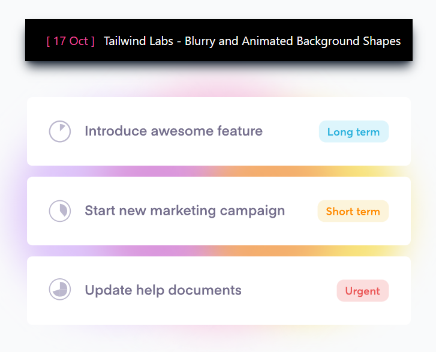

## Blurry and Animated Background Shapes - Tailwind Labs

---
### Link to [Live Demo]() and [Tailwind play](https://play.tailwindcss.com/ULwT6MTmWI)

> Not Responsive yet - Best viewed on large screens (Preferably Laptop Screens)

### What new things did I learn from this ?

* ``mix-blend-multiply`` &rarr; This property blends the colors overlapping in order to get the variation of two colors. Its for like Intersection of two colors.
  
* ``filter`` &rarr; This utility is used to enable other filters in combination like ``blur`` or ``grayscale``
  
* I took the div's which can be seen as image from the qoals website instead of creating own div's as it saved my time. (I know how to create these div's but dint feel like wasting much time on it.)

* Learnt about how we can configure **input.css** file and **tailwind.config.js** file for creating ``animation`` and ``keyframes``. ``transform`` utility allows us to use ``translate`` and ``scale`` using which we are giving the movement to the shapes in certain manner.

* Link to [Tailwind Labs Tutorial](https://www.youtube.com/watch?v=Tmkr2kKUEgU)

* Link to [Tailwind Official Docs](https://tailwindcss.com/docs/installation)

---

| tailwind.config.js     | input.css               |
| ---------------------- | ---------------------- |
|     |     |
