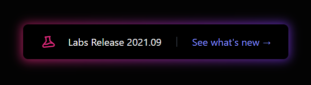
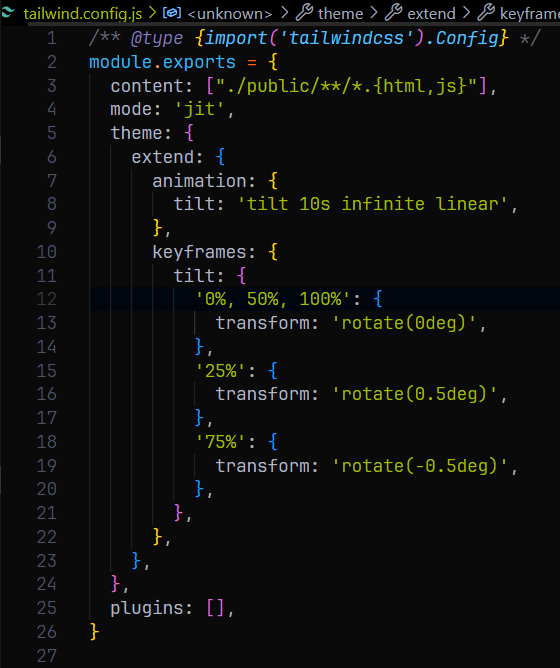
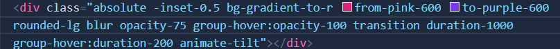

## Glowing Background Button - Tailwind Labs

### Link to Tailwind play - https://play.tailwindcss.com/fNKKyOG2Yv

### What new things did I learn from this ?
*  **-rotate-6** &rarr; for the beaker icon which rotates the icon slightly towards right.

*  **divide-x divide-gray-600** &rarr; This creates a dividing gray line between any two sentences in a container. Here it created a line between - **"Labs Release 2021.09 and See what's new &rarr;"**

* Learnt how to extend tailwind.config.js file for animation and keyframes for the background glow effect of the button.
---

---
* Learnt about how to group different elements and apply transition animation relatively. Here when we hover on the button the color of the **See what's new &rarr;** changes from indigo to white and also the button glows up.
   
* As soon as we move our cursor from the button the text takes 2ms to transition back to indigo color whereas the background glow effect takes 1s to return back to normal state. So we have grouped the text and glow effect here on hover effect.

* At first I thought that button we see is showing the glow effect but in reality we created a div of pink color and set it to absolute so it stays behind the button we see. That pink div is made to glow when we hover on it. Below is the code for that pink div.
---
